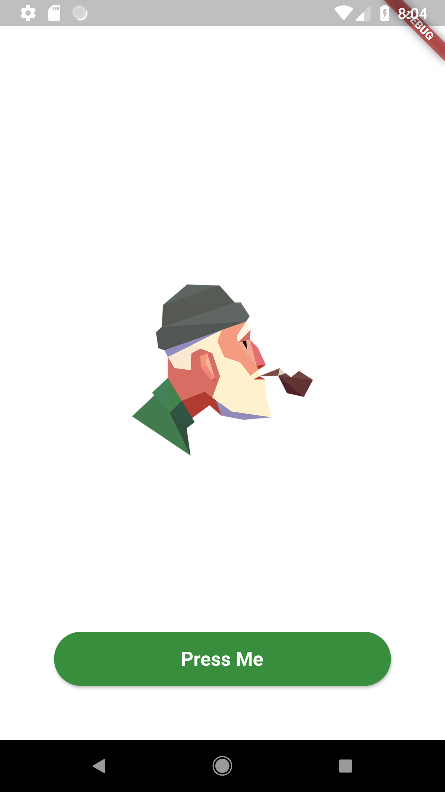

# design1

Flutter APP

<a href="https://github.com/doyle-jspy/flutterDesign/blob/master/design1/lib/main.dart"> Go ! </a>

# ScreenShot
</img>
</img>
</img>

*이미지 출처 :
https://pixabay.com/ko/illustrations/%EC%97%B0%EA%B8%B0-%EB%8A%99%EC%9D%80%EC%9D%B4-%ED%9D%A1%EC%97%B0-%EC%98%A4%EB%9E%98-%EB%90%9C-4387774/*
